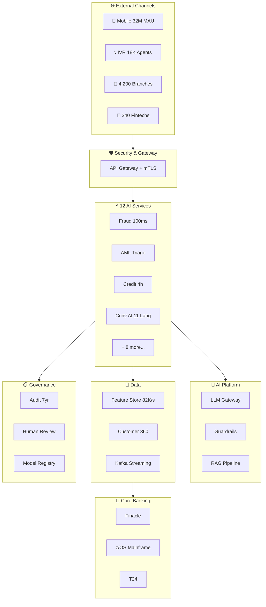
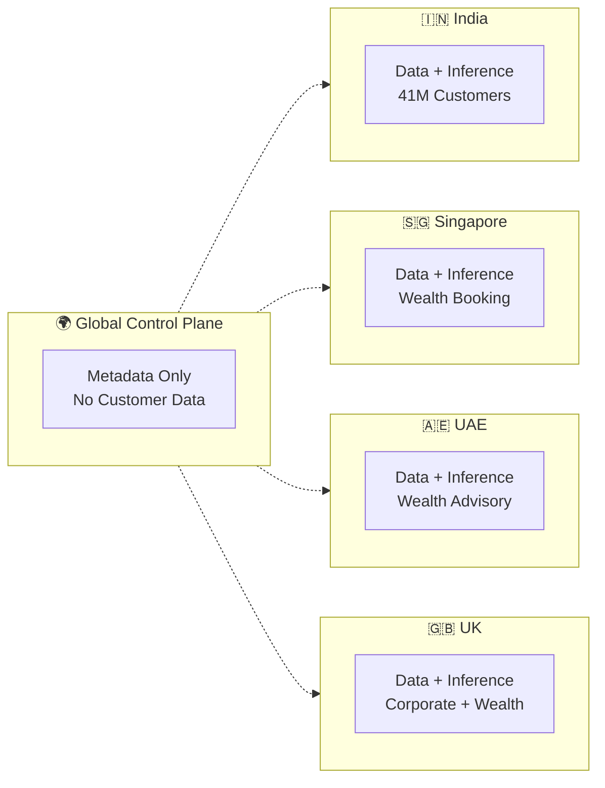

# Architecture Diagrams

## How to View

These diagrams are in **Mermaid** format (`.mmd` files). You can render them as images using:

### Option 1: VS Code Extension
Install the "Markdown Preview Mermaid Support" or "Mermaid Editor" extension in VS Code.

### Option 2: Mermaid Live Editor
Copy the content of any `.mmd` file into [https://mermaid.live](https://mermaid.live) to render and export as PNG/SVG.

### Option 3: Mermaid CLI
```bash
npm install -g @mermaid-js/mermaid-cli
mmdc -i architecture-overview.mmd -o architecture-overview.png -w 2400 -H 1800
mmdc -i regional-deployment.mmd -o regional-deployment.png -w 1800 -H 1200
mmdc -i fraud-flow.mmd -o fraud-flow.png -w 2400 -H 2000
mmdc -i ai-platform-layers.mmd -o ai-platform-layers.png -w 2400 -H 2000
```

### Option 4: Draw.io
Import the `.drawio` file directly into [draw.io](https://app.diagrams.net) for editing.

---

## Diagram Index

| File | Description | Type |
|------|-------------|------|
| `architecture-overview.mmd` | **Full platform architecture** — all layers from channels through AI services to core banking | Flowchart |
| `regional-deployment.mmd` | **Multi-region deployment** — India, Singapore, UAE, UK with data residency isolation | Flowchart |
| `fraud-flow.mmd` | **End-to-end UPI fraud flow** — ₹2,40,000 payment with borderline score, SCA, agent escalation | Sequence |
| `ai-platform-layers.mmd` | **AI platform layer cake** — detailed breakdown of control plane, model serving, RAG, services | Flowchart |

---

## Architecture Overview (Inline Preview)



---

## Regional Deployment (Inline Preview)


